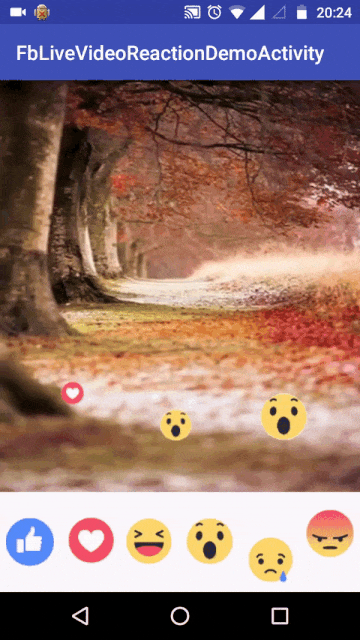

#Fb Live Video Reactions

## Overview
This project is inspired by the Live Video Reactions on Facebook. I have used RxJava2 for handling the stream of reactions (like,love, haha, wow, sad, angry). **I have put one extra condition that the time duration between two reactions should be atleast 300 ms **. This is achieved very easily by RxJava by using Flowable<Timed>. 

## Demo
&nbsp; &nbsp; &nbsp; &nbsp; &nbsp; &nbsp; &nbsp; &nbsp; &nbsp; &nbsp; &nbsp; &nbsp; &nbsp; &nbsp; &nbsp; &nbsp; &nbsp; &nbsp; &nbsp; &nbsp; &nbsp; &nbsp; &nbsp; &nbsp; 

I wrote a blog about how I used RxJava2 for achieving this. [Here](https://medium.com/@anshuljain/rxjava2-demo-1-facebook-live-video-emoticons-streams-10f5211bc62#.mwgmwi7pa) is the post.

